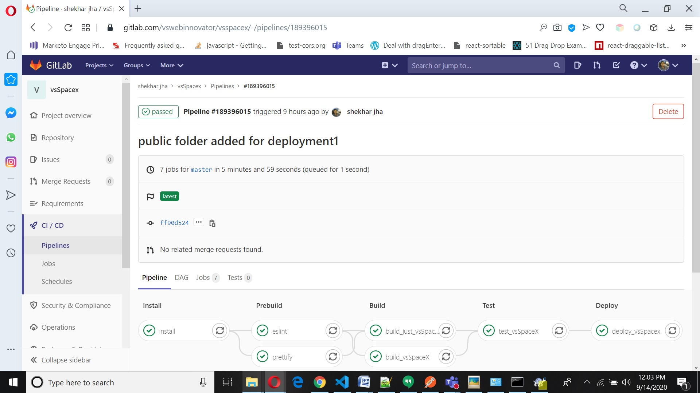
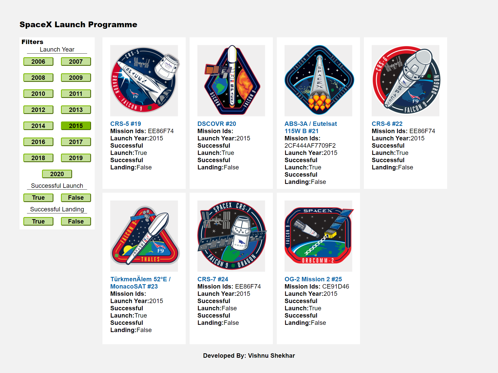
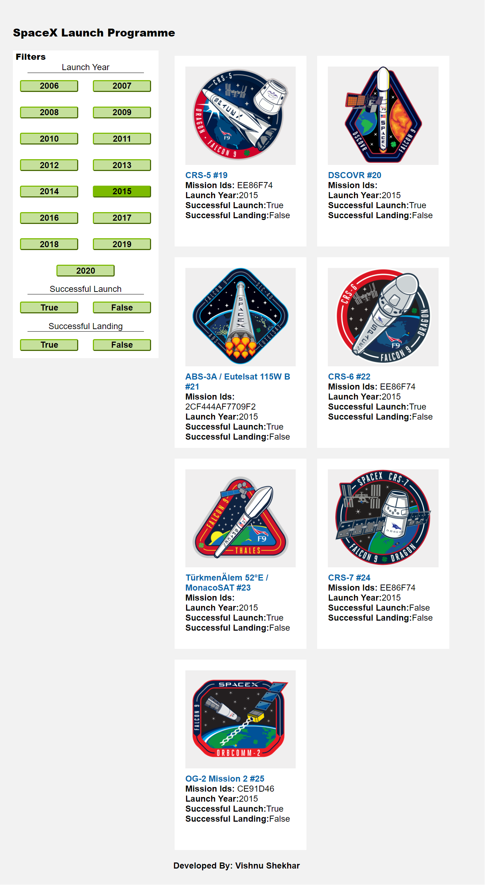
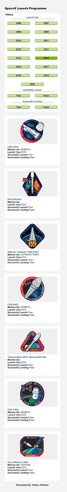

# vsspacex

##### Commands to run 


```shell
Steps for Running Project: 
$ npm install 
$ npm run dev

Flow of the application 
package > script.js > server.js > rout__index.js > page_index >launchYearComponent >Tiles => Rendered
```

Steps for setup Project(vsspacex)
```shell
git config user.name "vshekharjha"
git config user.email vswebinnovator@gmail.com

$ssh-keygen -t rsa -b 4096 -C "vswebinnovator@gmail.com"
eval $(ssh-agent -s)
ssh-add "C:\Users\vishnu.shekhar\spacekey1"

git clone git@gitlab.com:vswebinnovator/vsspacex.git
git init
git add .
git commit -m "First commit"
git remote add origin git@gitlab.com:vswebinnovator/vsspacex.git
git push origin master
```

### Prerequisites
**Approach and stack details **
-   Docker (to pull images from registry)

-   Yarn - package manager

-   Node

-   GIT

-   EXPRESS

-   IDE: Visual Studio code (development, preferred)

- yarn
- webpack
- babel
- Express (SSR)
- tslint & prettify
- gitLab

--- 

By Default Searver side rendering is implimented and when user click on filter client side Rendering happens by calling the api with applied filters.

**“Server-Side Rendering”**
_-	Functionalities_
1.	Theinitial launch programs landing page have server side rendered.

2.	Can be used as A boilerplate to implement the Server-side rendering.

**“Build and Packaging”**
_-	Functionalities_
1.	Build  have basic set of static code quality checks and  fail the build if there is any error.

**“Client Side”**
_-	Functionalities_
1.	User should be able to Filter the results with help of provided Filters.
	Filter options are hard coded with the values shownin the visual comp below.
	Applying any Filter should reflect the below changes:
•	Selected filter should change to selected state as shown in the visual comp (and should mimic the toggle behavior).
•	Applied filters should change the URL and update the Page with latest records without refreshing the page.
•	If the page is refreshed with the applied filters in the URL – the resulting page should be server side rendered & subsequent filters should again be client side rendered.


**-	Responsive Design and other UI elements.**
1.	Page should visually match with the provided designs at the end of this file.
2.	Responsive Behavior – Expectation is to do a custom media query implementation and not use bootstrap or similar responsive framework:
	Implementation should follow Mobile first design approach
	Mobile View: Page should have only one Column until 700 px. We have provided the Visual designs for Mobile screen.
	Tablet View: Page should have 2 columns between 700 and 1024 px. Design is provided for Desktop tile and that should be followed for this viewport.
	Desktop View: Page should have 4 columns between 1024 and1440 px. Beyond 1440pxviewport, the content will be centered align with a max width of 1440.

**-	On git - Elaborate your approach and stack details in the Readme file.**
npm
yarn
webpack
babel
Express (SSR)
tslint & prettify
gitLab

pipeline 
  

Screenshot of Different View Desktop , Tablet View and Mobile View
  

  

  


